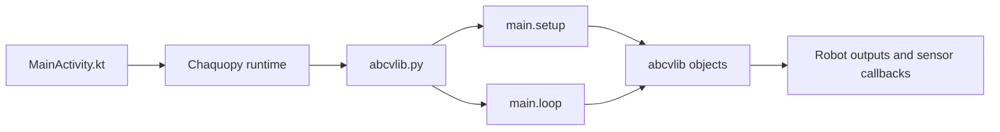

# Python Demo Apps

The Python demo apps are Android apps that run Python code on the phone through
Chaquopy. Kotlin still owns Android lifecycle, permissions, USB serial setup,
publisher setup, and UI wiring.

## Included Apps

- `backAndForthPython`: minimal Python wheel-output loop.
- `basicSubscriberPython`: Python subscriber example that receives sensor and
  robot callbacks through Kotlin/Java interfaces.

## Runtime Flow



`MainActivity.kt` starts Chaquopy, loads the Python `abcvlib` module, injects
Android-side objects, then runs the Python loop on a background coroutine.

`abcvlib.py` is bridge code. It receives injected objects from Kotlin and calls
`main.setup()` once, followed by repeated `main.loop()` calls.

`main.py` is the app-specific Python code.

## Where To Customize

For `backAndForthPython`, edit:

```text
apps/backAndForthPython/src/main/python/main.py
```

For `basicSubscriberPython`, edit:

```text
apps/basicSubscriberPython/src/main/python/main.py
```

Use `main.setup()` for one-time initialization and `main.loop()` for repeated
control logic.

The `abcvlib.py` files are bridge code. Change them only when the Python runtime
or Kotlin/Python handoff needs to change.

The `MainActivity.kt` files are Android app wiring. Change them when the app
needs different publishers, UI bindings, serial setup, or injected Python
objects.

## Subscriber Pattern

`basicSubscriberPython` uses `java.dynamic_proxy` to implement abcvlib subscriber
interfaces in Python. For example, a Python class can implement
`WheelDataSubscriber` and receive wheel count, distance, and speed updates.

The app creates publishers in `main.setup()`, attaches Python subscribers, starts
the publishers, and then calls `context.onSetupReady()` so the Android activity
can finish serial setup.

## Python Environment

Python code runs inside the Android app on the phone, not on the development
computer. Python dependencies must be compatible with Chaquopy and declared in
the app module's Gradle configuration.

Build, install, launch, and target selection use the same app CLI workflow as
the other demo apps.
