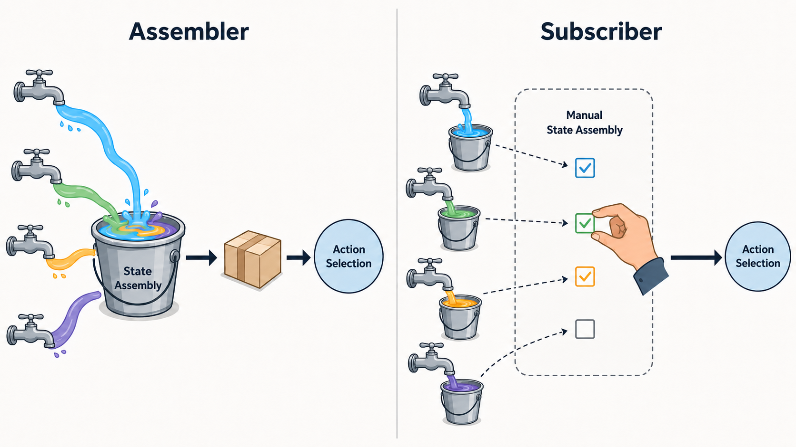

# Reinforcement Learning Applications

`basicAssembler` is the current RL-oriented demo app.

## Assembler Or Subscriber



Use assembled `TimeStepData` when you want a simpler loop:

```text
state for this timestep -> policy -> action
```

Use direct subscriber callbacks when you need finer timing control, every raw
callback event, or custom handling for sensors that update at different rates.

## State Space

```text
State data
├── wheelData
│   ├── left
│   │   ├── timestamps[]
│   │   ├── counts[]
│   │   ├── distances[]
│   │   ├── speedsInstantaneous[]
│   │   ├── speedsBuffered[]
│   │   └── speedsExpAvg[]
│   └── right
│       ├── timestamps[]
│       ├── counts[]
│       ├── distances[]
│       ├── speedsInstantaneous[]
│       ├── speedsBuffered[]
│       └── speedsExpAvg[]
├── batteryData
│   ├── timestamps[]
│   └── voltage[]
├── chargerData
│   ├── timestamps[]
│   ├── chargerVoltage[]
│   └── coilVoltage[]
├── orientationData
│   ├── timestamps[]
│   ├── tiltAngle[]
│   └── angularVelocity[]
├── soundData
│   ├── startTime
│   ├── endTime
│   ├── totalTime
│   ├── sampleRate
│   ├── totalSamples
│   ├── totalSamplesCalculatedViaTime
│   └── levels[]
├── imageData
│   └── images[]
│       ├── timestamp
│       ├── width
│       ├── height
│       ├── bitmap
│       └── webpImage
├── qrCodeData
│   └── qrDataDecoded
└── objectDetectorData
    ├── labels/categories
    ├── confidence scores
    ├── bounding boxes
    ├── timestamps
    └── image dimensions
```

## Assembled TimeStepData

`TimeStepDataBuffer` writes callback data into the current timestep window.
When the trial advances, `nextTimeStep()` moves the read/write pointers and
clears the next write slot.

Represented sensor callbacks are generally accumulated during the timestep
window, not reduced to only the latest value.

Assembled `TimeStepData` follows the state tree above, plus selected actions,
except for the gaps listed below.

Known gaps:

- QR code data is not yet stored in `TimeStepData`: [#258](https://github.com/tekkura/sr-android/issues/258).
- Object detection data is not yet stored in `TimeStepData`: [#259](https://github.com/tekkura/sr-android/issues/259).
- Per-callback sound metadata is not yet preserved in `TimeStepData`: [#260](https://github.com/tekkura/sr-android/issues/260).

## Action Space

### Low-Level Outputs

```text
Low-level outputs
├── Wheel output
│   └── outputs.setWheelOutput(left, right, leftBrake, rightBrake)
│       ├── left: -1.0 to 1.0
│       ├── right: -1.0 to 1.0
│       ├── leftBrake: Boolean
│       └── rightBrake: Boolean
└── QR display
    ├── QRCode.generate(data2Encode, foregroundColor)
    └── QRCode.close()
```

### basicAssembler Action Wrapper

```text
ActionSpace
├── MotionActionSpace
│   └── MotionAction
│       ├── actionName
│       ├── actionByte
│       ├── leftWheelPWM
│       ├── rightWheelPWM
│       ├── leftWheelBrake
│       └── rightWheelBrake
└── CommActionSpace
    └── CommAction
        ├── actionName
        └── actionByte
```

Example `basicAssembler` motion actions:

```text
stop
forward
backward
left
right
```

### Higher-Level Behaviors

`comprehensiveDemo` contains app-level behaviors such as charging and mating
logic. These are not yet refactored into the shared library action API. See
[#228](https://github.com/tekkura/sr-android/issues/228).
